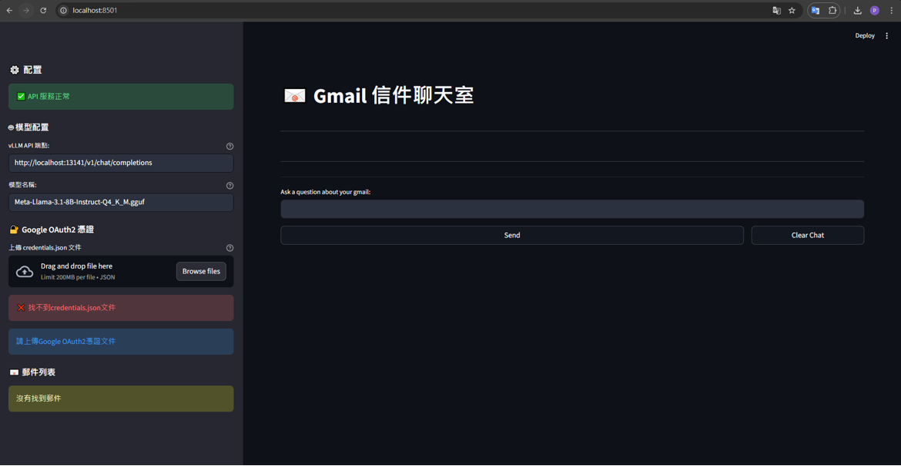
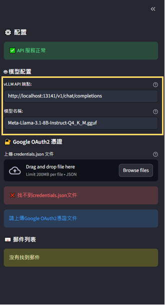
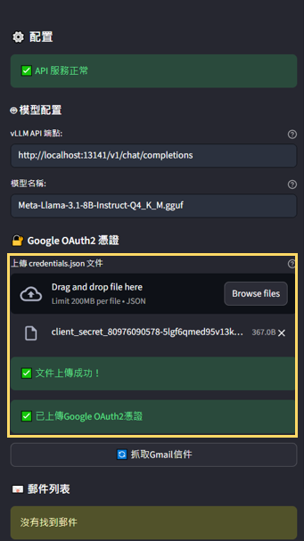
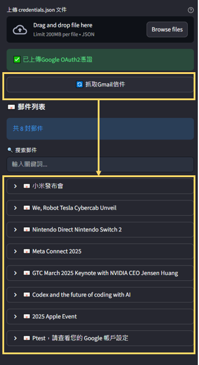
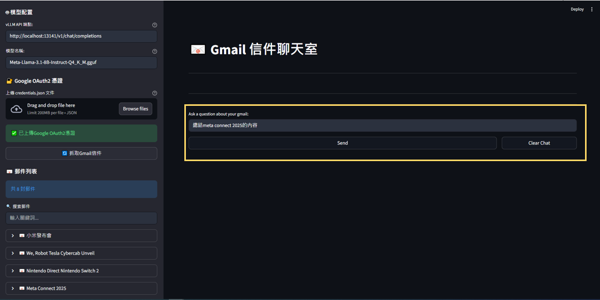

# 📨 Chat with Gmail User Manual

LLM app with RAG to chat with Gmail. The app uses Retrieval Augmented Generation (RAG) to provide accurate answers to questions based on the content of your Gmail Inbox.

## Installation

1. **Clone the repository**
   ```bash
   git clone <repository-url>
   cd chat_with_gmail
   ```
  
2. **Download the embedding model**
   ```bash
   git clone https://huggingface.co/intfloat/multilingual-e5-large
   ```
   
   
## Gmail API Setup 

#### Step 1: Create Google Cloud Project

1. Go to [Google Cloud Console](https://console.cloud.google.com/)
2. Create a new project or select an existing one
3. Enable the Gmail API:
   - Navigate to "APIs & Services" > "Library"
   - Search for "Gmail API" and enable it

#### Step 2: Configure OAuth Consent Screen

1. Go to "APIs & Services" > "OAuth consent screen"
2. Choose "External" and fill in the required information
3. Add your Gmail address to the test users list
4. Publish the application (you can keep it in testing mode for personal use)

#### Step 3: Create OAuth 2.0 Credentials

1. Go to "APIs & Services" > "Credentials"
2. Click "Create Credentials" > "OAuth client ID"
3. Choose "Desktop application"
4. Download the credentials file and rename it to `credentials.json`

#### Step 4: Scope Settings
1. Go to "Data Access" 
2. Click "Add or remove scopes"
3. Search "https://www.googleapis.com/auth/gmail.send" and enable it
4. Update and save 

## 💬 Using the Chat Interface

1. Click `Reuse_Start_Llama_Server.bat` to start the llama.cpp server.

2. Go to `chat_with_gmail` folder and click `start.bat`. This scripts will:
- Check all prerequisites
- Install dependencies automatically
- Start both the API server and Streamlit UI

3. Access the chat room at http://localhost:8501 (default)


4. Fill in the vllm endpoint and the model name.


5. Upload your `credentials.json`.


6. Click on `search gmail inbox` button. All your emails will be listed below.


7. Ask questions related to your emails in the chat room.

