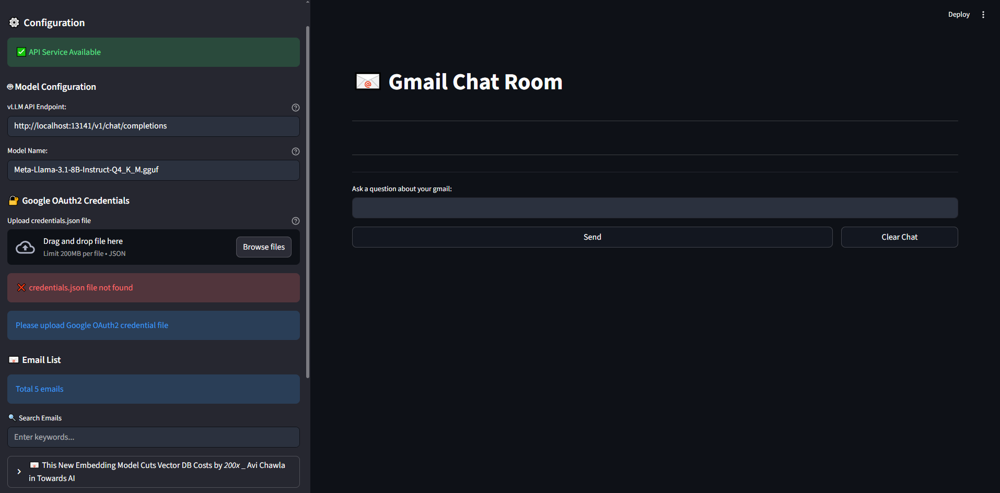
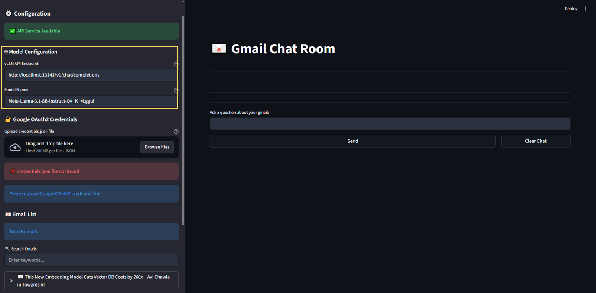
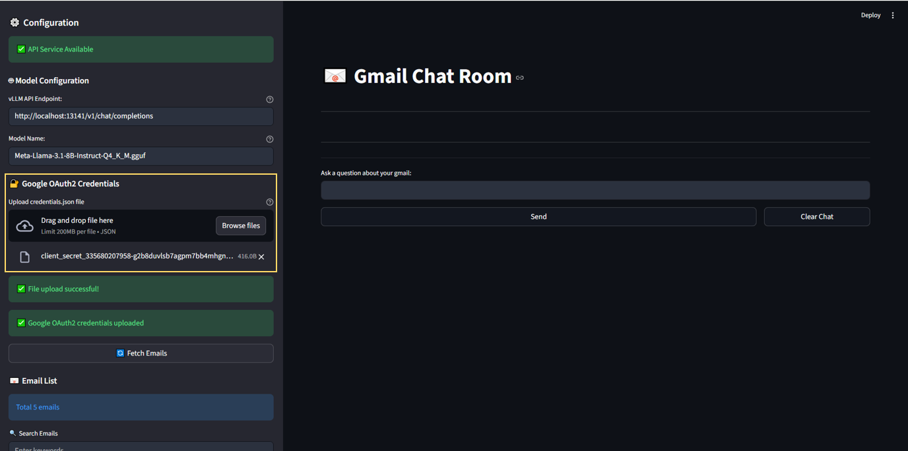
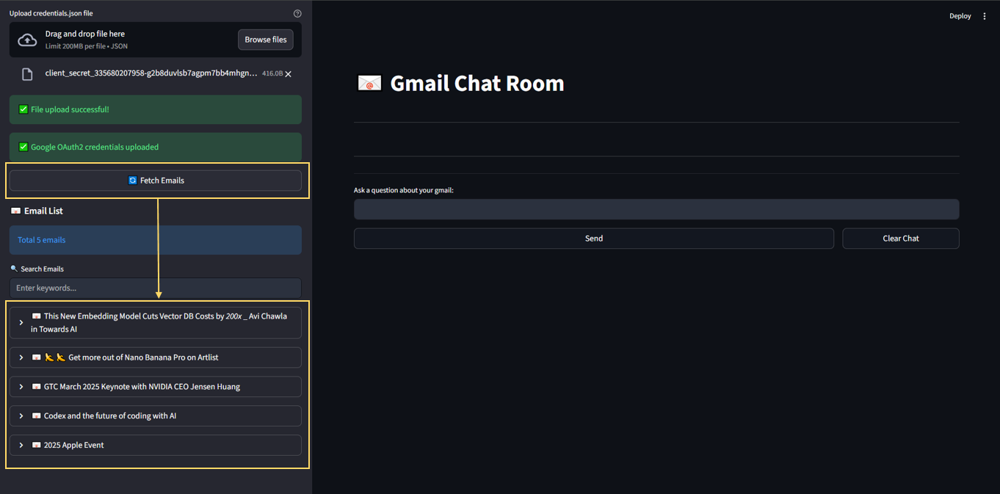
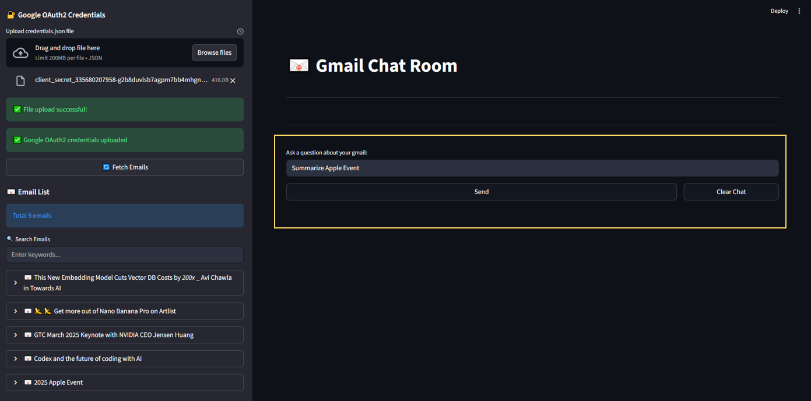

# Chat with Gmail User Guide

## Overview
LLM app with RAG to chat with Gmail. The app uses Retrieval Augmented Generation (RAG) to provide accurate answers to questions based on the content of your Gmail Inbox.

---

## Chapter 1: Installation and Setting

### Installation Steps

1. Download the `Installer.zip` file and extract its contents.
2. Launch the application by clicking on `start.bat`. The chat room will be automatically opened in your web browser.
  
## Chapter 2: How to Use?

### Usage Workflow

#### A. **Initial Setup**

#### Step 1: Create Google Cloud Project

1. Go to [Google Cloud Console](https://console.cloud.google.com/)
2. Create a new project or select an existing one
3. Enable the Gmail API:
   - Navigate to "APIs & Services" > "Library"
   - Search for "Gmail API" and enable it

#### Step 2: Configure OAuth Consent Screen

1. Navigate to "APIs & Services" > "OAuth consent screen" > "Overview"
2. Click on "Get Started" and fill in the required information, including App Information, Audience and Contact Information
3. Go to the "Audience" section and add your Gmail address to the test users list
4. Publish the application (you can keep it in testing mode for personal use)

#### Step 3: Create OAuth 2.0 Credentials

1. Navigate to "APIs & Services" > "Credentials"
2. Click on "Create Credentials" and select "OAuth client ID"
3. Choose "Desktop application" and click on "Create"
4. Download the credentials file `credentials.json`

#### Step 4: Scope Settings
1. Search for "Data Access" 
2. Click on "Add or remove scopes"
3. Paste "https://www.googleapis.com/auth/gmail.send" into the "Manually add scopes" field and click on "Add to table"
4. Update the settings and save your changes 

### B. **Basic Operation**
1. Click on `start.bat` to launch the chat interface. The chat room will be automatically opened at http://localhost:8501 (default). 

2. Fill in the vllm endpoint and the model name.

3. Upload your `credentials.json`.

4. Click on `Fetch Emails` button. All your emails will be listed below.

5. Ask questions related to your emails in the chat room.

